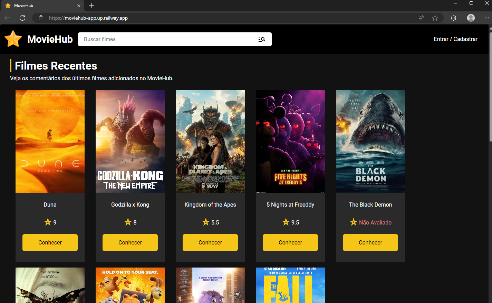
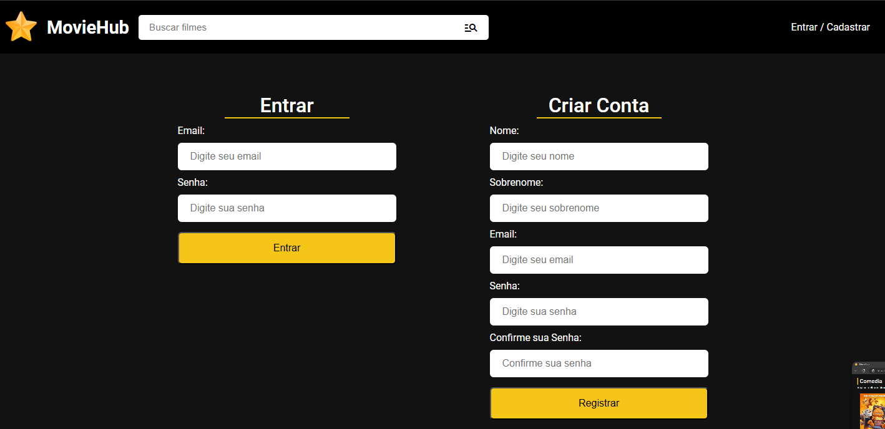

# Projeto MovieHub - Rede Social de Filmes

Um projeto web de filmes desenvolvido em PHP e MySQL, utilizando PDO para a conexão com o banco de dados e no paradigma POO (orientado a objetos). Este projeto permite a criação de contas de usuários, adição de filmes e comentários sobre esses filmes. O projeto pode realizar deploy por meio do railway.app.
### Para ver o projeto em execução na nuvem entre em contato: jose.c.lima.sp@gmail.com


## Screenshots

### Pagina Inicial / HOME


### Login e Cadastro de site dinâmico


### Ver detalhes do filme e adicionar comentário, assim como editar / excluir o comentário já feito


### Pesquisa de filmes por nome


## Funcionalidades

- **Criação de Contas de Usuários**: Os usuários podem criar contas (email e senha) para interagir com a plataforma.
- **Adição de Filmes**: Os usuários podem adicionar novos filmes ao banco de dados.
- **Comentários em Filmes**: Os usuários podem comentar sobre os filmes adicionados e colocar a sua nota .

## Tecnologias Utilizadas

- **PHP**: Linguagem principal do projeto.
- **MySQL**: Banco de dados utilizado para armazenar informações de usuários, filmes e comentários.
- **PDO (PHP Data Objects)**: Utilizado para a conexão segura com o banco de dados.
- **POO (Programação orientada a objetos)**, foi desenvolvido dentro desse paradigma de programação.
- **Railway.app**: Plataforma de deploy utilizada para hospedar o projeto.

## Instalação

Para executar este projeto localmente, siga as instruções abaixo:

1. Clone o repositório:
    ``` bash
    git clone https://github.com/JoseClaudiolima/MovieHub
    ```

2. Navegue até o diretório do projeto:
    ``` bash
    cd path-do-repositório-clonado
    ```

3. Configure o arquivo de conexão com o banco de dados `config.php` com suas credenciais:
    Comumente segue o padrão abaixo
    ```php
    $host = 'localhost';
    $dbname = 'moviehub';
    $user = 'root';
    $pass = '';
    $port = '3306';
    ```

4. Importe o arquivo `database.sql` para criar as tabelas no banco de dados.
    Pode ser importado dentro de softwares similares a SQL Workbench, ou por meio de código, usando:
    ```sql
    USE database_name;
    source caminho/para/database.sql;
    ```
  Obs: em "USE database_name", é notório que precisa criar o database antes, com o comando CREATE DATABASE database_name.


6. Inicie o servidor local, por meio de software como XAMPP ou por meio de comandos no prompt:
    ```bash
    php -S localhost:8080
    ```


## Licença

Este projeto está licenciado sob a Licença MIT. Veja o arquivo [LICENSE](LICENSE) para mais detalhes.

## Contato

Para mais informações, entre em contato através de [jose.c.lima.sp@gmail.com](mailto:jose.c.lima.sp@gmail.com).
